# 🌱 Plant Care App

*Plant Care App* is a smart mobile application that helps users manage their plants while detecting potential diseases using AI.  
Users can register/login via **email, Google authentication (Supabase)**, add plants with species and watering frequency, care reminders, and analyze plant health with **Gemini AI**.

---

## 🎯 Purpose

Plant Care App is designed to make plant care easier and smarter.  
With AI-powered disease detection and multi-platform login options, it provides a seamless experience for plant enthusiasts to monitor and manage their green friends.

---

## 🧩 App Architecture

Built using *clean architecture* principles for scalability and maintainability:

| 🧱 Layer      | 📌 Description                                  |
|--------------|------------------------------------------------|
| *Pages*      | UI screens and layouts                         |
| *Widgets*    | Reusable buttons, fields, and visual components|
| *Data*       | Auth repository, Supabase integration          |
| *Core*       | Responsive helpers, configs, and constants     |
| *Services*   | AI (Gemini) and authentication logic           |

---

## 🚀 Features

<ul>
  <li>🔐 <strong>Authentication</strong>: Email/Password with Supabase.</li>
  <li>🔑 <strong>OAuth</strong>: Google Sign-In and Apple Sign-In integration (Supabase OAuth).</li>
  <li>🌿 <strong>Plant Management</strong>: Add, view, and delete plants with species & watering schedule.</li>
  <li>⏰ <strong>Care Reminders</strong>: Stay on top of watering cycles.</li>
  <li>🤖 <strong>AI Disease Detection</strong>: Upload plant photos and get insights powered by <strong>Gemini AI (Vision + Text)</strong>.</li>
  <li>📊 <strong>Dashboard</strong>: View total plants, tasks, and recent activity in one glance.</li>
  <li>📱 <strong>Modern UI</strong>: Dark-themed, minimal, and responsive design.</li>
</ul>

---

## 📸 Screenshots

<p align="center">
  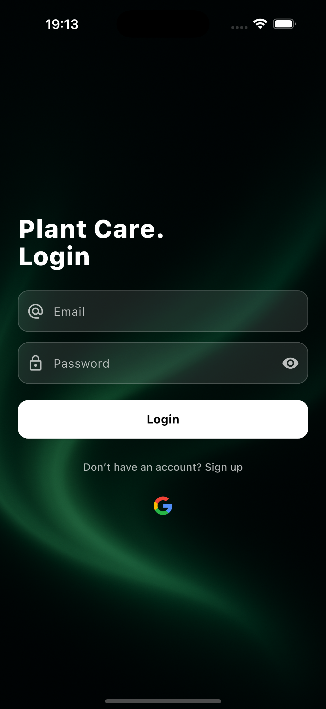
  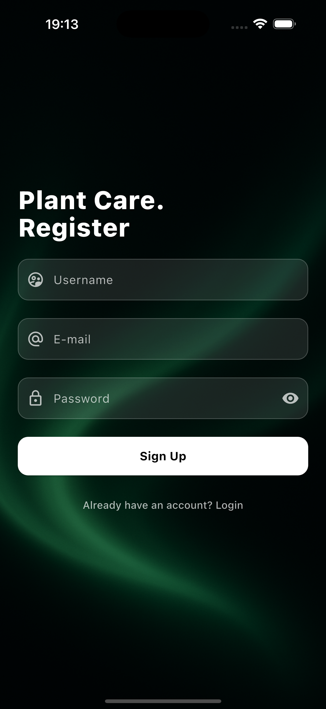
  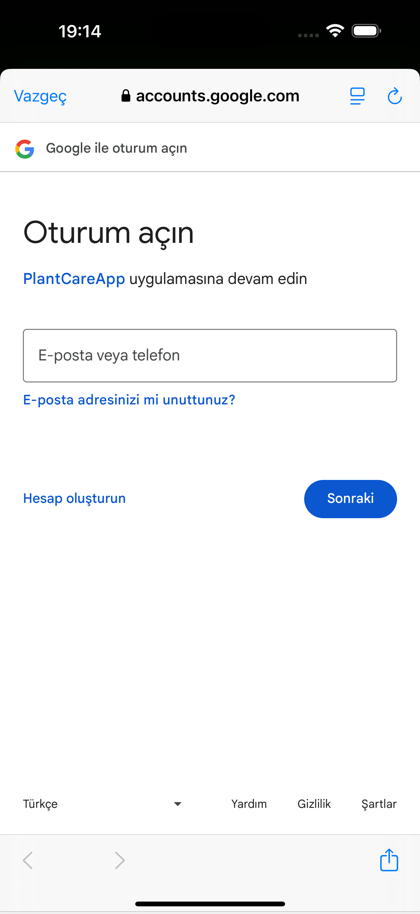
  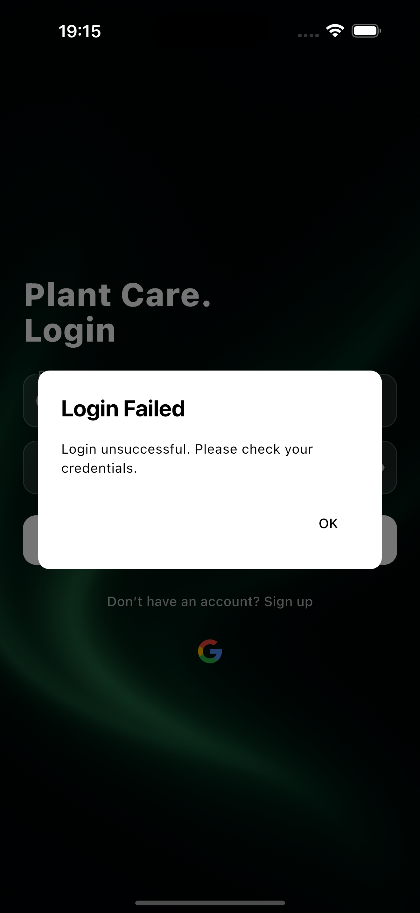
  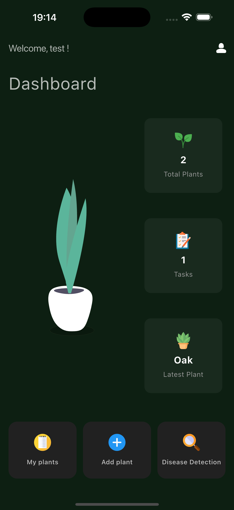
  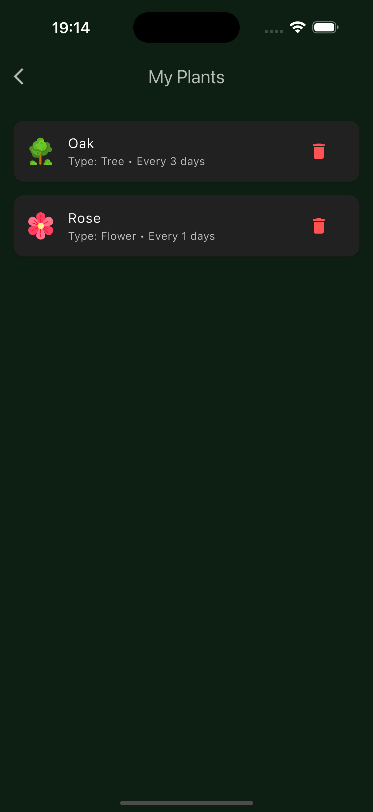
  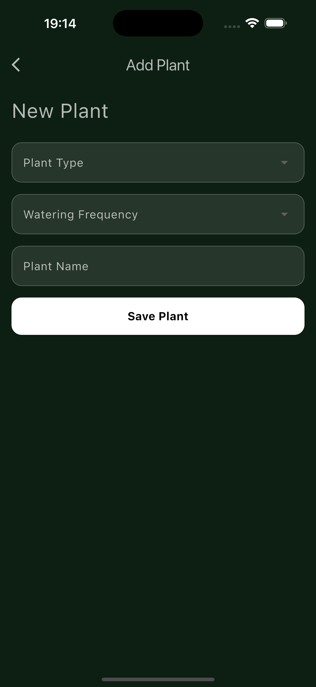
  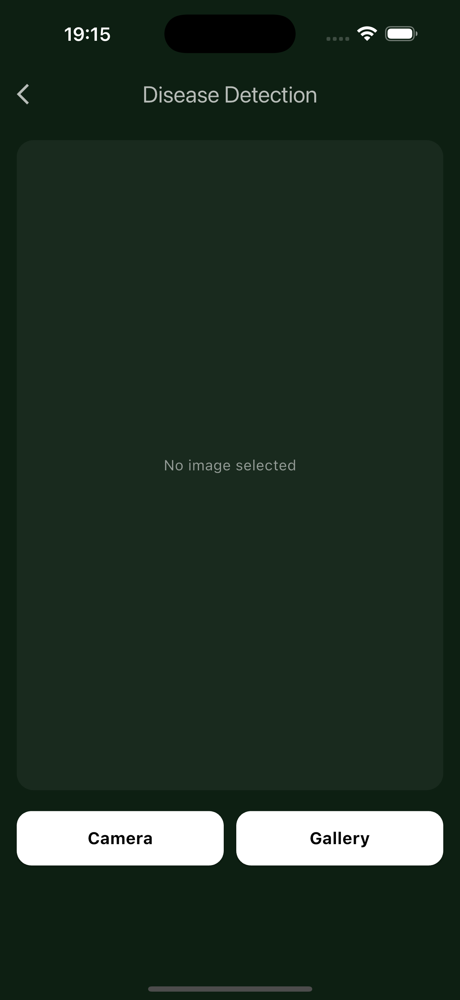
  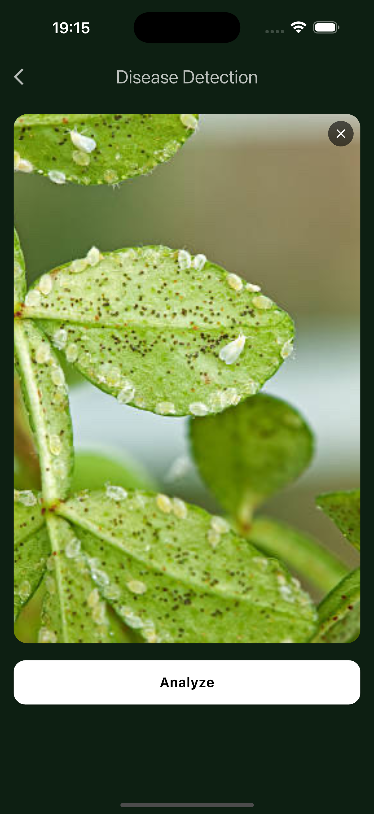
  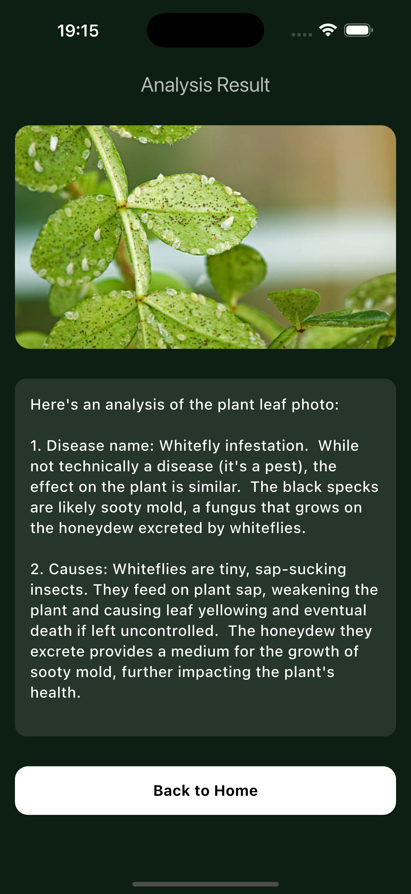
  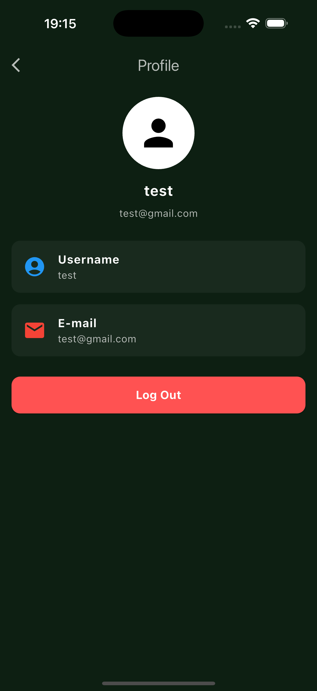
</p>

---

## ⚙️ Technologies Used

- **Flutter** & **Dart**  
- **Supabase** (Authentication, Database, Row-Level Security Policies)  
- **Google Sign-In (OAuth via Supabase)  
- **Gemini AI** (Plant disease detection via Vision + Text API)  
- **REST APIs**  
- **Responsive UI** with custom widgets  

---

## 📱 Platforms

• Android  
• iOS  

---

## 📦 Installation

### Prerequisites

• Flutter SDK (latest stable version)  
• Dart SDK  
• Android Studio, VS Code, or another Flutter-compatible IDE  
• Android/iOS simulator or physical device  

### Steps

```bash
# Clone the repository
git clone https://github.com/bsaltalii/plant_care_app.git

# Navigate to the project directory
cd plant_care_app

# Install dependencies
flutter pub get

# Run the app
flutter run
